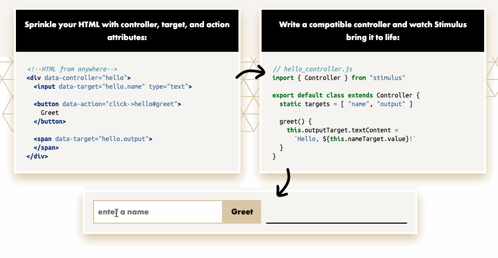
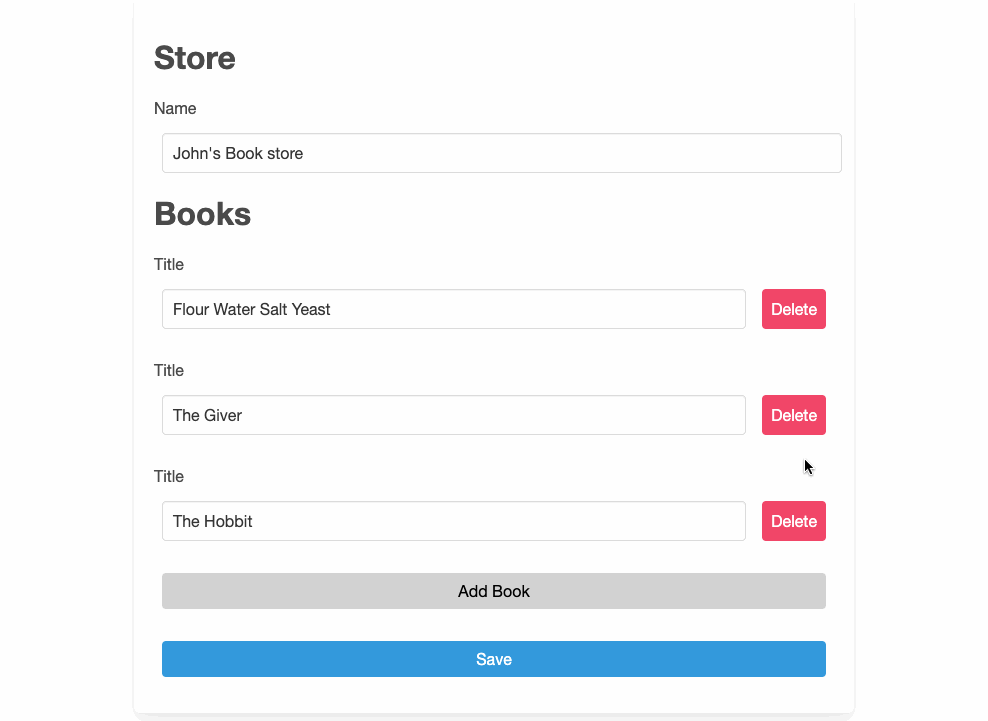

autoscale: true
# StimulusJS
## (with Rails Nested Attributes)

---

# What is StimulusJS?

> Stimulus is a JavaScript framework with modest ambitions. It doesn’t seek to take over your entire front-end—in fact, it’s not concerned with rendering HTML at all. Instead, it’s designed to augment your HTML with just enough behavior to make it shine.
-- stimulusjs.org

<br>
Made by Basecamp (of Rails fame)

---

# Goals of Stimulus

- Not a full front-end framework
- Add interactivity to existing code
- Easy to add
- Reusable/separation of concerns

---

# Three Core Parts

- Controllers
  - Written in javascript
- Actions
  - `data-action` attribute with a value like
    `controller-name#methodName`
- Targets
  - `data-target` with values like `controller-name.targetName`

---

## Let's start with our HTML

```html
<div>
  <input type="text">
  <button>Greet</button>
</div>
```

---

## Add a Controller

```javascript
// src/controllers/hello_controller.js
import { Controller } from "stimulus"

export default class extends Controller {
}
```

---

[.code-highlight: 1]

## Hook it up

```html
<div data-controller="hello">
  <input type="text">
  <button>Greet</button>
</div>
```

---

[.code-highlight: 5-7]

## Can You Hear Me Now?

```javascript
// src/controllers/hello_controller.js
import { Controller } from "stimulus"

export default class extends Controller {
  connect() {
    console.log("Hello, Stimulus!", this.element)
  }
}
```

In Console
`Hello Stimulus, <div....`

---

[.code-highlight: 5-7]

## Let's Say Hi

```javascript
// src/controllers/hello_controller.js
import { Controller } from "stimulus"

export default class extends Controller {
  greet() {
    console.log("Hello, Stimulus!", this.element)
  }
}
```

---

[.code-highlight: 3]

## Hook Up Action

```html
<div data-controller="hello">
  <input type="text">
  <button data-action="click->hello#greet">Greet</button>
</div>
```

---

## Default Actions

|Element|Default Event|
|---|---|
|a|click|
|button|click|
|form|submit|
|input|change|
|input type=submit|click|
|select|change|
|textarea|change|

---

[.code-highlight: 3]

## Let's Try that Again

Don't need the `click->`

```html
<div data-controller="hello">
  <input type="text">
  <button data-action="hello#greet">Greet</button>
</div>
```

^ Also resize for window

---

[.code-highlight: 2]

## Let's Change Something

```html
<div data-controller="hello">
  <input data-target="hello.name" type="text">
  <button data-action="hello#greet">Greet</button>
</div>
```

---

[.code-highlight: 5]
[.code-highlight: 7-11]

## Targets in the Controller

```javascript
// src/controllers/hello_controller.js
import { Controller } from "stimulus"

export default class extends Controller {
  static targets = [ "name" ]

  greet() {
    const element = this.nameTarget
    const name = element.value
    console.log(`Hello, ${name}!`)
  }
}
```

---



---

# Nested Attributes

Rails feature where you can update `has_one` or `has_many` relationships via a parent resources `create` or `update` methods.

---

[.code-highlight: all]
[.code-highlight: 4]

## Modeling

```ruby
class Store < ApplicationRecord
  has_many :books

  accepts_nested_attributes_for :books, allow_destroy: true

  # :reject_if -> takes a proc
  # :limit -> how many can you update
  # :update_only -> for has_one relationships
end
```

---

[.code-highlight: all]
[.code-highlight: 5]
[.code-highlight: 6]
[.code-highlight: 7]

## Params

```ruby
{
  store: {
    name: "John's store",
    books_attributes: {
      "0" => { title: "Lord of the Rings" }, # new record
      "1" => { id: 4, title: "Dictionary" }, # update
      "2" => { id: 2, _destroy: 1 }, # destroy
    },
  },
}
```

---

## Dynamic

So, let's say we want to have a page where we can add multiple books and change the store name.

Anything that involves adding multiple books means we need to need to generate inputs. So either we need to hide a large number of inputs and slowly reveal them, or we need to build them when the user requests it.

---



---

[.code-highlight: all]
[.code-highlight: 2]
[.code-highlight: 4-5]
[.code-highlight: 8-10]

## Our Html

```erb
<div>
  <%= form_with model: @store do |form|%>
    <h1>Store</h1>
    <%= form.label :name %>
    <%= form.text_field :name %>
    <h1>Books</h1>
    <div>
      <%= form.fields_for :books do |book_form| %>
        <%= render partial: "book_fields", locals: { book_form: book_form } %>
      <% end %>
    </div>
    <div class="fields">
      <%= button_tag "Add Book", class: "new" %>
    </div>
    <div class="fields">
      <%= form.button "Save", type: :submit %>
    </div>
  <% end %>
</div>
```

---

[.code-highlight: all]
[.code-highlight: 6]

## Book Field

```html
<div class="fieldset">
  <%= book_form.label :title %>
  <div class="fields">
    <%= book_form.text_field :title %>
    <%= button_tag "Delete", class: "delete" %>
    <%= book_form.hidden_field :_destroy, value: 0 %>
  </div>
</div>
```

^ We can't destroy nothing, so it's fine on new ones

---

[.code-highlight: all]
[.code-highlight: 9-11]

## Controller

```ruby
@store = Store.includes(:books).find(params[:id])

if @store.update(update_params)
  redirect_to @store
else
  render :edit
end
# ...
def update_params
  params.require(:store).permit(:id, :name, books_attributes: %i[id title _destroy])
end
```

---

[.code-highlight: 3-5]

## Let's Destroy

```erb
<%= book_form.hidden_field :_destroy,
    value: 0,
    data: {
      target: "destroy.destroyInput",
    } %>
```

---

[.code-highlight: 3-6]

## Update our Button

```erb
<%= button_tag "Delete",
    class: "delete",
    data: {
      action: "destroy#deleteRow",
      index: book_form.index,
    } %>
```

^ We have an index from the form builder

---

[.code-highlight: all]
[.code-highlight: 6]
[.code-highlight: 8-13]
[.code-highlight: 9]
[.code-highlight: 10-12]

```javascript
// controllers/destroy_controller.js

import { Controller } from "stimulus";

export default class extends Controller {
  static targets = ["destroyInput"];

  deleteRow() {
    event.preventDefault();

    let inputIndex = event.currentTarget.getAttribute("data-index");
    this.destroyInputTargets[inputIndex].value = 1;
  }
}
```

---

[.code-highlight: all]
[.code-highlight: 4]

## Hide and Seek

```javascript
deleteRow() {
  event.preventDefault();

  event.currentTarget.closest(".fieldset").classList.toggle("hidden");
  let inputIndex = event.currentTarget.getAttribute("data-index");
  this.destroyInputTargets[inputIndex].value = 1;
}
```

---

## Let's Modularize

Now we have a controller that destroys things and hides them.

But what if we want to hide something? Or maybe change a different value other than destroy?

---

## Toggle Controller - HTML

Div

```html
<div data-controller="toggle" data-toggle-class="hidden">
```

Button

[.code-highlight: 2, 4]

```erb
<%= button_tag "Delete",
    class: "delete",
    data: {
      action: "toggle#toggle",
      index: book_form.index,
    } %>
```

---

[.code-highlight: all]
[.code-highlight: 11]

## Toggle Controller - JS

```javascript
// controllers/toggle_controller.js

import { Controller } from "stimulus";

export default class extends Controller {
  static targets = ["content"];

  toggle(event) {
    event.preventDefault();
    const toggleIndex = event.currentTarget.getAttribute("data-index");
    this.contentTargets[toggleIndex].classList.toggle(this.data.get("class"));
  }
}
```

---

## Value Controller - HTML

Div

```html
<div data-controller="toggle value" data-value="1">
```

Button

[.code-highlight: all]
[.code-highlight: 4]

```erb
<%= button_tag "Delete",
    class: "delete",
    data: {
      action: "toggle#toggle value#update",
    } %>
```

---

[.code-highlight: 4]

## Value Controller - HTML

Book Field

```erb
<%= book_form.hidden_field :_destroy,
  value: 0,
  data: {
    target: "value.content",
  } %>
```

---

[.code-highlight: 11]

## Value Controller

```javascript
// controllers/value_controller.js

import { Controller } from "stimulus";

export default class extends Controller {
  static targets = ["content"];

  update(event) {
    event.preventDefault();
    const valueIndex = event.currentTarget.getAttribute("data-index");
    this.contentTargets[valueIndex].value = this.data.get("value");
  }
}
```

---

## Let's Add Some Fields!

---

We need to produce this:

```html
<div class="fieldset">
  <label for="store_books_attributes_1_title">Title</label>
  <div class="fields">
    <input type="text"
           value="Lord of the Rings"
           name="store[books_attributes][1][title]"
           id="store_books_attributes_1_title" />
    <button name="button" type="submit" class="delete">Delete</button>
      <input value="0"
             type="hidden"
             name="store[books_attributes][1][_destroy]"
             id="store_books_attributes_1__destroy" />
  </div>
</div>

<input type="hidden"
       value="25"
       name="store[books_attributes][1][id]"
       id="store_books_attributes_1_id" /></div>
```

---

## How Rails Does Nested Attributes

```html
<input ... store[books_attributes][1][title] />
```

---

## How can we most easily do this?

---

[.code-highlight: all]
[.code-highlight: 4]
[.code-highlight: 5]
[.code-highlight: 7-11]

## Our Server Renders the Fields

```ruby
module FormFields
  class StoreBooksController < ApplicationController
    def new
      store = Store.new
      store.books.build

      helpers.form_for(store) do |form|
        form.fields_for :books do |book_form|
          render partial: "stores/book_fields", locals: { book_form: book_form }
        end
      end
    end
  end
end
```

---

If we do that, we get:


```html
<input name="store[books_attributes][1][id]" id="store_books_attributes_0_id" />
...
<input name="store[books_attributes][1][id]" id="store_books_attributes_1_id" />
...
<input name="store[books_attributes][1][id]" id="store_books_attributes_0_id" />
...
<input name="store[books_attributes][1][id]" id="store_books_attributes_0_id" />
```

---

[.code-highlight: 2]

## Rails to the Rescue

There is a `child_index` parameter to set the starting index.

```ruby
form.fields_for :books,
  child_index: params[:index] do |book_form|
```

---

## So what is our abstraction?

---

Per the stimulus docs, this is a "content loader". Or maybe for now, an indexed content loader.

---

[.code-highlight: all]
[.code-highlight: 1]
[.code-highlight: 2]
[.code-highlight: 3]
[.code-highlight: 4]
[.code-highlight: 9]

## IndexedContent - HTML


```erb
<div data-controller="toggle value indexed-content-loader"
     data-indexed-content-loader-next-index=<%= @store.books.length %>
     data-indexed-content-loader-insert-location="beforeend"
     data-indexed-content-loader-url="/form_fields/store_books/new"
     ...>

<%= button_tag "Add Book",
    class: "new",
    data: { action: "indexed-content-loader#insert" } %>
```

---

[.code-highlight: all]
[.code-highlight: 7-9]

IndexedContent - JS

```javascript
// src/controllers/indexed_content_loader_controller.js
import { Controller } from "stimulus";

export default class extends Controller {
  static targets = ["container"];

  connect() {
    this.nextIndex = this.data.get("next-index");
  }

```

---

[.code-highlight: all]
[.code-highlight: 2]
[.code-highlight: 4-5]

```javascript
  insert() {
    event.preventDefault();

    let controller = this;
    let queryString = `?index=${this.nextIndex++}`;
  }
```

^ We could also add a query string

---

[.code-highlight: all]
[.code-highlight: 6]

```javascript
  let url = this.data.get("url") + queryString;
  fetch(url)
    .then((response) => response.text())
    .then((html) => {
      controller.containerTarget.insertAdjacentHTML(
        controller.data.get("insert-location"),
        html
      );
    });
}
```

---


---

# Links

[StimlusJS](https://stimulusjs.org)
[Example App](https://github.com/dewyze/alexandria)
[Sneak Peeks Into Hey!  Technology](https://dev.to/borama/a-few-sneak-peeks-into-hey-com-technology-i-intro-4bjg)

---

# Questions?
